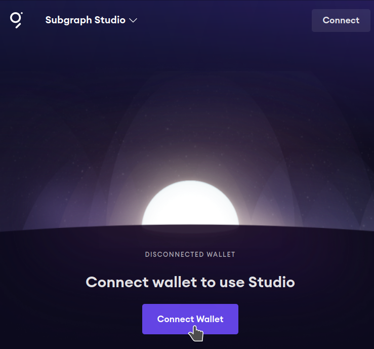
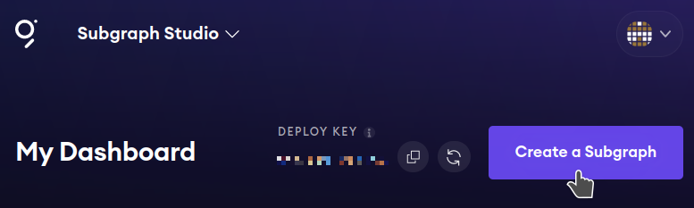
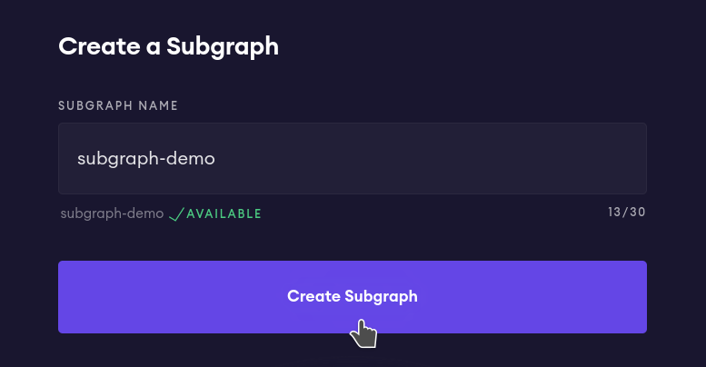
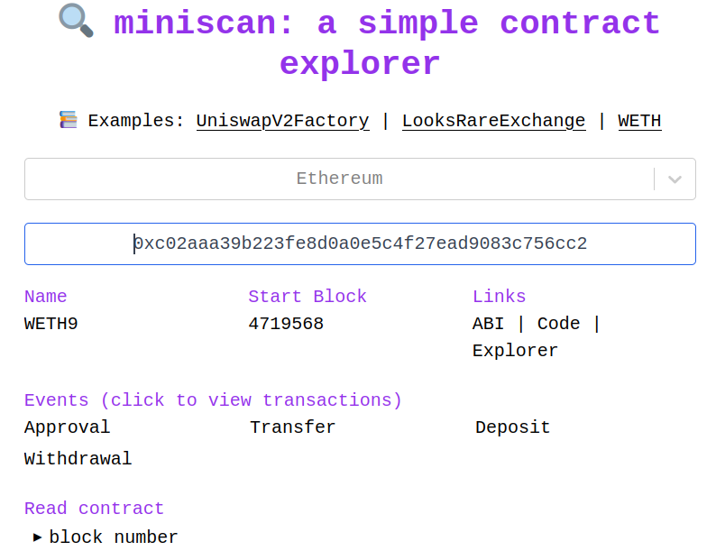
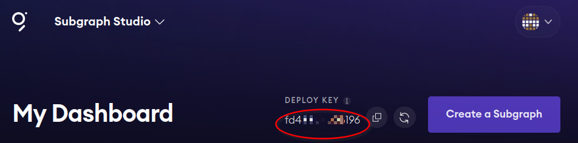
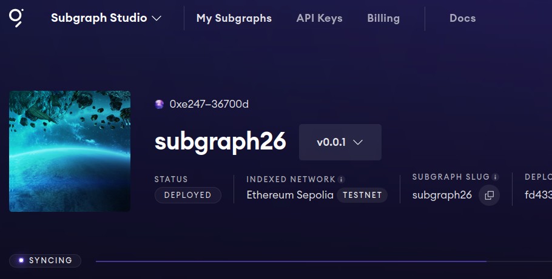

**This is demo of how get started with The Graph by using Subgraph Studio.**

We use The Graph to index data to read from blockchains in a decentralized way.

In this demo we will:
1. Create a subgraph
2. Publish it
3. Query it from the command line
4. Query it from a Javascript application

The subgraph we will create will index the events of a smart contract. In this case we will use [Test Tether USD token (USDT)](https://sepolia.etherscan.io/token/0x7169d38820dfd117c3fa1f22a697dba58d90ba06) in [Sepolia](https://sepolia.etherscan.io/).

We will get the last two transfers of 10 USDT in Sepolia.

---


<!-- START doctoc generated TOC please keep comment here to allow auto update -->
<!-- DON'T EDIT THIS SECTION, INSTEAD RE-RUN doctoc TO UPDATE -->
**Table of Contents** 

- [Deploy a subgraph using Graph Studio](#deploy-a-subgraph-using-graph-studio)
  - [1. Login The Graph Studio](#1-login-the-graph-studio)
  - [2. Create a new subgraph](#2-create-a-new-subgraph)
  - [3. Install graph-cli and initialize the subgraph](#3-install-graph-cli-and-initialize-the-subgraph)
  - [3. Choose a contract to index](#3-choose-a-contract-to-index)
  - [4. Initialize the subgraph](#4-initialize-the-subgraph)
  - [5. Get your Deploy Key](#5-get-your-deploy-key)
  - [6. Authenticate in CLI](#6-authenticate-in-cli)
  - [6. Build the subgraph](#6-build-the-subgraph)
  - [7. Deploy to Studio](#7-deploy-to-studio)
  - [8. Change schema.graphql](#8-change-schemagraphql)
- [Example Query](#example-query)
  - [1. Query from Studio](#1-query-from-studio)
  - [2. From our command line](#2-from-our-command-line)
  - [3 Query from an application](#3-query-from-an-application)
- [Side Notes](#side-notes)
- [API KEY](#api-key)

<!-- END doctoc generated TOC please keep comment here to allow auto update -->


## Deploy a subgraph using Graph Studio

### 1. Login The Graph Studio

Go to [The Graph Studio](https://thegraph.com/studio) and login using your web3 wallet.



### 2. Create a new subgraph

Create a new subgraph and give it a name.

In this example we'll call it: `subgraph26`





### 3. Install graph-cli and initialize the subgraph

Install [graph-cli](https://www.npmjs.com/package/@graphprotocol/graph-cli)'s npm package.

To install graph-cli you will need [nodejs](https://nodejs.org/en) and [npm](https://www.npmjs.com/) installed in your computer. On a Debian/Ubuntu based system you can install them with:

```bash
sudo apt install nodejs npm
```

Alternatively if you don't want to install anything on your system but have [docker](https://www.docker.com/) installed you can use the run it in an npm container with `docker run -it node:latest /bin/bash`.

Once you have `nodejs` and `npm` installed you can install `graph-cli` with:

```bash
npm install -g @graphprotocol/graph-cli
```

### 4. Choose a contract to index

In this example we are going to look at [Test Tether USD token (USDT)](https://sepolia.etherscan.io/token/0x7169d38820dfd117c3fa1f22a697dba58d90ba06). Looking in Etherscan we can see that the contract address is `0x7169d38820dfd117c3fa1f22a697dba58d90ba06`.

### 5. Initialize the subgraph

Initialize the subgraph (this will create a subfolder with the same name as the subgraph)

```bash
graph init --studio subgraph26
```
This commands will ask you some questions, which we explain below,

```bash
$ graph init --studio subgraph26

✔ Protocol · ethereum
✔ Subgraph slug · subgraph26
✔ Directory to create the subgraph in · subgraph26
✔ Ethereum network · sepolia
✔ Contract address · 0x7169d38820dfd117c3fa1f22a697dba58d90ba06
✔ Fetching ABI from Etherscan
✖ Failed to fetch Start Block: Failed to fetch contract creation transaction hash
  
✔ Start Block · 2060228
✔ Contract Name · TetherToken
✔ Index contract events as entities (Y/n) · true
  Generate subgraph
  Write subgraph to directory
✔ Create subgraph scaffold
✔ Initialize networks config
✔ Initialize subgraph repository
✔ Install dependencies with yarn
✔ Generate ABI and schema types with yarn codegen
Add another contract? (y/n): 
Subgraph subgraph26 created in subgraph26

Next steps:

  1. Run `graph auth` to authenticate with your deploy key.

  2. Type `cd subgraph26` to enter the subgraph.

  3. Run `yarn deploy` to deploy the subgraph.

Make sure to visit the documentation on https://thegraph.com/docs/ for further information.
```

* *Protocol* is the blockchain you want to index. In this case is `ethereum`.
* *Subgraph slug* is the name of the subgraph. In this case is `subgraph26`.
* *Directory to create the subgraph in* is the name of the folder where the subgraph will be created. In this case is `subgraph26`.
* *Ethereum network* is the name of the network where the contract is deployed. In this case is `sepolia`, which is a Ethereum Testnet.
* *Contract address* is the address of the contract you want to index. In this case is `0x7169d38820dfd117c3fa1f22a697dba58d90ba06`.
* *Start Block* is the block where the contract was deployed. You can find it in Etherscan. For example, for Test USDT in Sepolia it's `2060228`.
* *Contract name* is is best practice to add the same name of the contract. In this case it is `TetherToken`.
Index contract events as entities is `true` because we want to index the events of the contract.
* *Add another contract* is `n` because we don't want to add more contracts.


Another useful tool to get all the info I need about a smart contract is [miniscan.xyz](https://miniscan.xyz). Not all blockchains are supported, but for the ones that are, you can get useful information like the Start block very easyly.



### 6. Get your Deploy Key

At the top of the dashboard in Subgraph Studio you will see your *Deploy Key*. Copy it.




### 7. Authenticate in CLI

Replacing `mykey` with your Deploy Key:

```bash
$ graph auth --studio mykey
```

### 8. Build the subgraph

```bash
$ cd subgraph26 && graph codegen && graph build
```

Output should something like this:

```
  Skip migration: Bump mapping apiVersion from 0.0.1 to 0.0.2
  Skip migration: Bump mapping apiVersion from 0.0.2 to 0.0.3
  Skip migration: Bump mapping apiVersion from 0.0.3 to 0.0.4
  Skip migration: Bump mapping apiVersion from 0.0.4 to 0.0.5
  Skip migration: Bump mapping apiVersion from 0.0.5 to 0.0.6
  Skip migration: Bump manifest specVersion from 0.0.1 to 0.0.2
  Skip migration: Bump manifest specVersion from 0.0.2 to 0.0.4
✔ Apply migrations
✔ Load subgraph from subgraph.yaml
  Load contract ABI from abis/TetherToken.json
✔ Load contract ABIs
  Generate types for contract ABI: TetherToken (abis/TetherToken.json)
  Write types to generated/TetherToken/TetherToken.ts
✔ Generate types for contract ABIs
✔ Generate types for data source templates
✔ Load data source template ABIs
✔ Generate types for data source template ABIs
✔ Load GraphQL schema from schema.graphql
  Write types to generated/schema.ts
✔ Generate types for GraphQL schema

Types generated successfully

  Skip migration: Bump mapping apiVersion from 0.0.1 to 0.0.2
  Skip migration: Bump mapping apiVersion from 0.0.2 to 0.0.3
  Skip migration: Bump mapping apiVersion from 0.0.3 to 0.0.4
  Skip migration: Bump mapping apiVersion from 0.0.4 to 0.0.5
  Skip migration: Bump mapping apiVersion from 0.0.5 to 0.0.6
  Skip migration: Bump manifest specVersion from 0.0.1 to 0.0.2
  Skip migration: Bump manifest specVersion from 0.0.2 to 0.0.4
✔ Apply migrations
✔ Load subgraph from subgraph.yaml
  Compile data source: TetherToken => build/TetherToken/TetherToken.wasm
✔ Compile subgraph
  Copy schema file build/schema.graphql
  Write subgraph file build/TetherToken/abis/TetherToken.json
  Write subgraph manifest build/subgraph.yaml
✔ Write compiled subgraph to build/

Build completed: build/subgraph.yaml
```

### 9. Deploy to Studio


```bash
$ graph deploy --studio subgraph26 
Which version label to use? (e.g. "v0.0.1"): v0.0.1
  Skip migration: Bump mapping apiVersion from 0.0.1 to 0.0.2
  Skip migration: Bump mapping apiVersion from 0.0.2 to 0.0.3
  Skip migration: Bump mapping apiVersion from 0.0.3 to 0.0.4
  Skip migration: Bump mapping apiVersion from 0.0.4 to 0.0.5
  Skip migration: Bump mapping apiVersion from 0.0.5 to 0.0.6
  Skip migration: Bump manifest specVersion from 0.0.1 to 0.0.2
  Skip migration: Bump manifest specVersion from 0.0.2 to 0.0.4
✔ Apply migrations
✔ Load subgraph from subgraph.yaml
  Compile data source: TetherToken => build/TetherToken/TetherToken.wasm
✔ Compile subgraph
  Copy schema file build/schema.graphql
  Write subgraph file build/TetherToken/abis/TetherToken.json
  Write subgraph manifest build/subgraph.yaml
✔ Write compiled subgraph to build/
  Add file to IPFS build/schema.graphql
                .. QmQjchRTvjddW2pyxBAN3sWop2GUw8iLNyu58toiKoJoM7
  Add file to IPFS build/TetherToken/abis/TetherToken.json
                .. QmSju3H214f3VXyD3yDXGc3nVcs1dgvkTDQfFDfZ2yksJw
  Add file to IPFS build/TetherToken/TetherToken.wasm
                .. QmYZAJ5i7tKG2yr7PZxfYdgRTqCyepUFXKdMT9cKALMXjU
✔ Upload subgraph to IPFS

Build completed: QmSYeKC1SDwhjH3U8FhcbpEdXz51PeySJvcXBvi1VE233b

Deployed to https://thegraph.com/studio/subgraph/subgraph26

Subgraph endpoints:
Queries (HTTP):     https://api.studio.thegraph.com/query/56687/subgraph26/v0.0.1
```

Now in Studio you should see the version deployed and syncing:



### 10. Optionally, change schema.graphql

By now you will have a file called `schema.graphql` in your folder, with a content similar to this:

```graphql
type Issue @entity(immutable: true) {
  id: Bytes!
  amount: BigInt! # uint256
  blockNumber: BigInt!
  blockTimestamp: BigInt!
  transactionHash: Bytes!
}

type Redeem @entity(immutable: true) {
  id: Bytes!
  amount: BigInt! # uint256
  blockNumber: BigInt!
  blockTimestamp: BigInt!
  transactionHash: Bytes!
}

type Deprecate @entity(immutable: true) {
  id: Bytes!
  newAddress: Bytes! # address
  blockNumber: BigInt!
  blockTimestamp: BigInt!
  transactionHash: Bytes!
}
...
```

We can now modify this graphql code to our needs and redeploy newer versions of my subgraph.

3 files are important here:

* `subgraph.yaml` - this is the main file that contains the name of the subgraph, the contract address, the start block, the schema and the mapping.
* `mappings.ts` - this is the file that contains the mapping of the contract events to the graphql schema.
* `schemas.graphql` - this is the file that contains the graphql schema.


## Example Query

Now lets query the subgraph. We can do it from the Studio or from the command line.

Let's query the last 2 transfers of 10 USDT in Sepolia, from the Studio and the command line.

### 1. Query from Studio

Subgraph Studio has a built in GraphQL IDE. You can access it by clicking on the `Playground` button. There we can enter the following query to get the last 2 transfers of 10 USDT in Sepolia:

```graphql
query firstquery {
  transfers(
    first: 2
    orderBy: blockNumber
    orderDirection: desc
    where: {value: "10000000"}
  ) {
    blockTimestamp
    id
    from
    to
    value
  }
}
```

Replies with:
```json
{
  "data": {
    "transfers": [
      {
        "blockTimestamp": "1703587716",
        "id": "0x9bd8286fbda4b3b7063c9a9d1b58c4c7821d40b45b8d2f80790425f8ec8e795c8b000000",
        "from": "0xa11180cb0f6669dc5fec6025f5b4db2bfa6efef8",
        "to": "0xdccd1e7ef46a5620081e581398d5a77bf1e9762d",
        "value": "10000000"
      },
      {
        "blockTimestamp": "1703587044",
        "id": "0x3190981d9f3bba9d75d3d06a1094472439d38ba82e7dee1db5074708521cf62721000000",
        "from": "0x110588449659e9d0ae778ea131bd095bc27bf4cb",
        "to": "0xa11180cb0f6669dc5fec6025f5b4db2bfa6efef8",
        "value": "10000000"
      }
    ]
  }
}
```

### 2. From our command line

We can also query the subgraph from the command line. For this we will need the Query URL. You can find it in the Studio and it will look like this:

```
https://api.studio.thegraph.com/query/56687/subgraph26/version/latest
```

Once we have the URL we can query the subgraph from the command line with curl:

```bash
curl -X POST -H "Content-Type: application/json" \
     --data '{ "query": "query firstquery { transfers(first: 2 orderBy: blockNumber orderDirection: desc where: {value: \"10000000\"}) { blockTimestamp id from to value } }" }' \
     https://api.studio.thegraph.com/query/56687/subgraph26/version/latest

```

And this will return the same result as before.


### 3. Query from an application

As an example we are going to run the same query from a Javascript application. The following javascript code will query the subgraph and print the result in the console in a human readable format.

```bash
npm install node-fetch
node callsubgraph26.mjs
```

This will output markdown code that displays the result in a table:

| BlockTimestamp | From | To | Value | ID |
| --- | --- | --- | --- | --- |
| 1703587716 | 0xa11180cb0f6669dc5fec6025f5b4db2bfa6efef8 | 0xdccd1e7ef46a5620081e581398d5a77bf1e9762d | 10000000 | 0x9bd8286fbda4b3b7063c9a9d1b58c4c7821d40b45b8d2f80790425f8ec8e795c8b000000 |
| 1703587044 | 0x110588449659e9d0ae778ea131bd095bc27bf4cb | 0xa11180cb0f6669dc5fec6025f5b4db2bfa6efef8 | 10000000 | 0x3190981d9f3bba9d75d3d06a1094472439d38ba82e7dee1db5074708521cf62721000000 |
